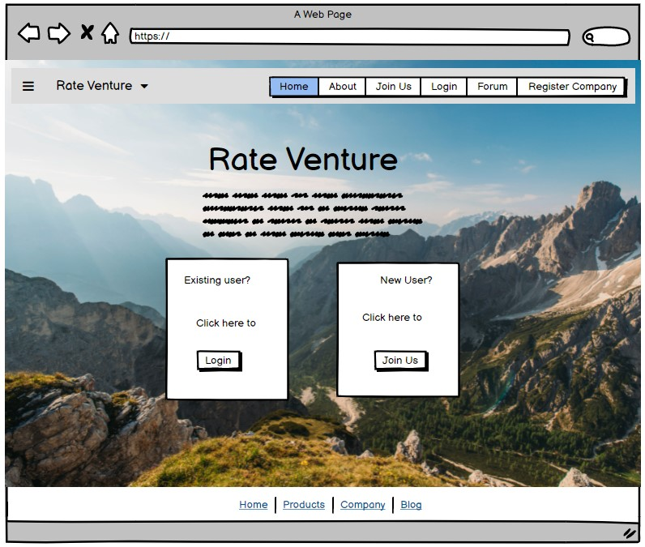

# Rate Venture

* [Link to deployed website]()
* [Link to github repository](https://github.com/phoebeireland/codeinstitutemilestoneproject3)

# Contents

1. UX
2. The Website
3. Testing the Site
4. Deployment
5. Credits

# UX

## The Project- Purpose and Buisness Goals

## User Stories
As a New User to the site, I want:
1. 
2. 
3. 

As a Returning User to the site, I want:
1. 
2. 
3. 
4. 

## Design Choices

### Font

### Colours

The main colours used on the site are:
* 
* 
* 

### Styling

## Wireframe Designs
I have provided additional information reagarding the wireframes below each picture. Please refer to them to explain where a wireframe may differ from the published product, or for choices behind the designs.

### Homepage

This image shows the initial idea for the main page of the website. This is the page that the users would see if they were not logged in or they did not yet have an account.
The homepage would only change slightly if the user did have an account and was logged in- ie. the two card boxes with information and buttons would change accordingly if a user was logged into their account. In addition, the navbar at the top would also display slightly different options depending on whether the user was logged in or not. 

### About Page

This image shows the inital idea for the about page. This is the page that explains to the unregistered/ not logged in user what the site is about and also offers some testimonials from users who have enjoyed the website. As is noticable, this design in the final product differs from the initial concept with the addition of the user accounts and a condensed paragraph regarding the site. Rather than allow it to fill the whole page, I moved it to the top left section, and added in a scenic picture to the right of the description. 

### Join Us Page

This image is the idea for the join us page. All in all, the page didn't change that much from the original concept to the executed version. THe only slight differenct would be the text at the top of the page before the form starts. 

### Login Page

### Forum Page

### Companies Page

### Register Companies Page

### Contact Us Page

# Features
* 
* 

### The Home Page
* 
* 
* 
* 
* 

### The About Page
* 
* 

### The Forum Page
* 
* 
* 
* 
* 
* 
* 

# Testing the Site

All HTML pages and CSS files were tested using the HTML and CSS Validator from W3.
* Link to the [HTML Validator](https://validator.w3.org./) used
* Link to the [CSS Validator](https://jigsaw.w3.org/css-validator/) used

## Manual Testing

Using the Chrome Inspect tool, the following aspects of the website were tested:
* 
* 
* 
* 
* 

The EmailJS extenstion was tested using a sample email address and sample message.
* The result of this test was that the EmailJS service sent an email to the connected email address saying that a message was submitted.
* Also, an Auto-Reply email was successfully sent to the email address provied in the form. 

## Small Problems (that were fixed)
* For some reason, the background image was being really difficult and was refusing to fit the page. This was eventually fixed by adding a couple of lines to the css code relating to the background image size (cover), background-repeat (no-repeat) and background-attachment (fixed).
* The login button was not loading the correct function, so the posts were not showing up on the forum when the page was loaded through the login button. This was fixed by making the login function call the function `get_posts` rather than `forum`. 
* 
* 

# Deployment
The Website was created in Visual Studio Code, version controlled with Git and hosted on Heroku.

Steps to publish website to Heroku:
1. 
2. 
3. 

Steps to publish website to GitHub Pages:
1. On the main page of the repository, click settings.
2. Go to the GitHub Pages section on the menu bar to the left.
3. In the Source section, click "None" and change the selected branch to "main". 
4. Leave the following option as (root), and click "Save"
5. Once the repository is published, a link to the website will be shown in the GitHub Pages section. 

To Clone this repository using IDE Terminal:
1. Navigate locally to the directory in which you want to save the repository.
2. On the main page of the repository, click the "Code" button, and copy the HTTPS address.
3. In the terminal, run the command: 'git clone' followed by the HTTPS address.
4. The project will now be saved to the desired directory. 

To Clone this repository using Visual Studio Code:
1. Open a new window in VSCode.
2. On the main page of the repository, click the "Code" button, and copy the HTTPS address.
3. Back in VSCode, under "Start" click "clone repository" and paste the link into the textbox that pops up.
4. Navigate into the folder that you want the repository to be saved into, and "Select Repository Location".
5. The repository will now be saved to the selected location.

# Credits

Created by Phoebe Ireland

The content of this website was created by Phoebe Ireland, with the exception of the following:
* [Google Fonts](https://fonts.google.com/)
  * Used to apply the Hahmlet font to all pages
* [Unsplash](https://unsplash.com/)
  * Used for the images found on the site
* [Bootstrap](https://getbootstrap.com/)
  * Used to create the Navbar
* [favicon.io](https://favicon.io/)
  * Used to create the favicon
* [jQuery](https://jquery.com/)
  * Uses jQuery for 
* Code Institute's Task Manager Project
  * Used to model most of the code for the site.
* [Emailjs](https://www.emailjs.com/)
  * Used to connect the contact form to an email service.
* [Balsamiq](https://balsamiq.com/)
  * Used to create the wireframes.

   All of the content that was taken from other sources was altered to fit the use of this website where necessary.

A special thank you to my mentor for helping me though the project, and pointing out my (numerous) mistakes. 