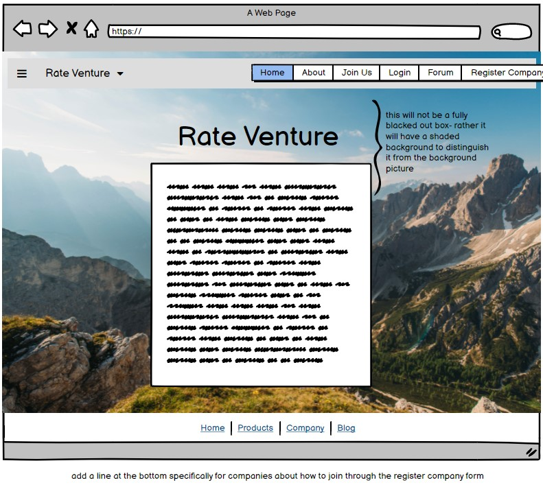
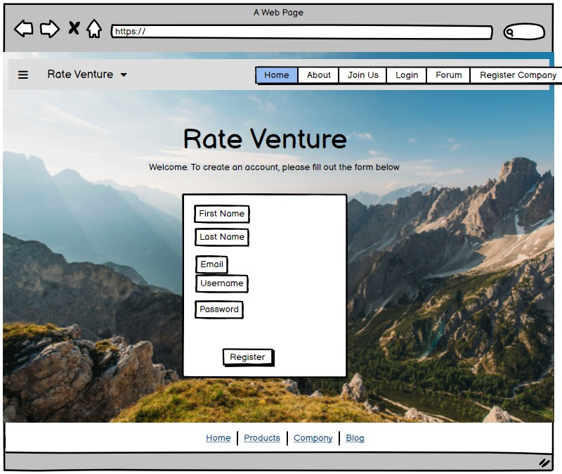
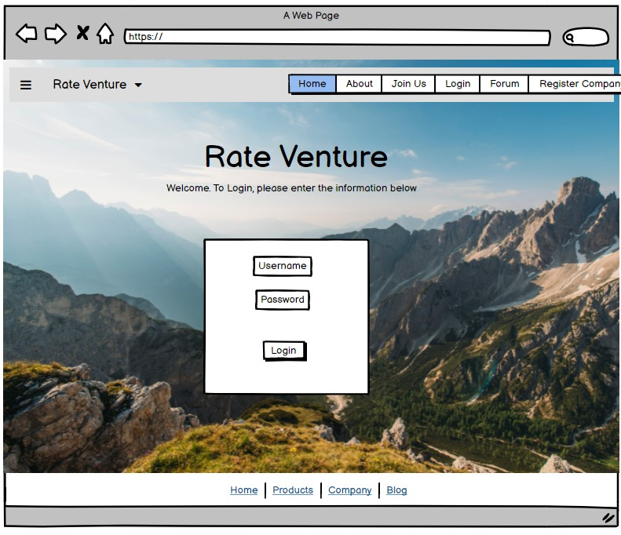
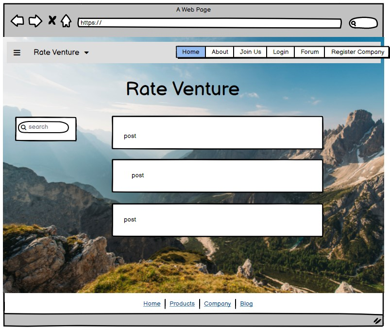
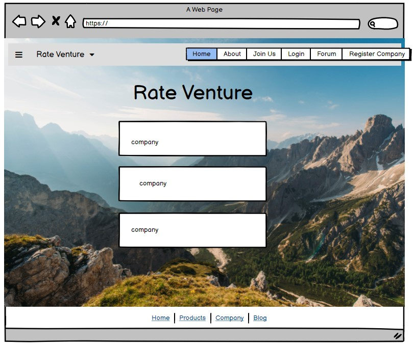
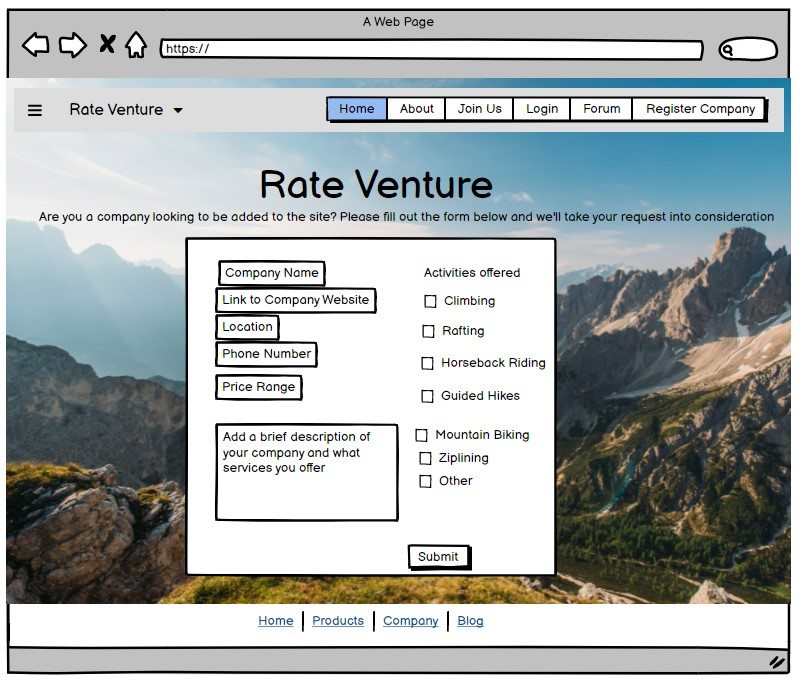
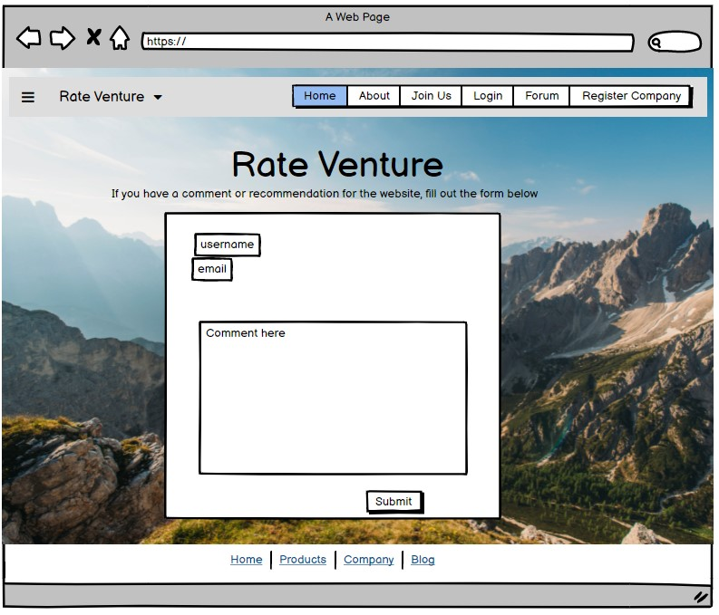

# Rate Venture

* [Link to deployed website](https://rateventure.herokuapp.com/)
* [Link to github repository](https://github.com/phoebeireland/codeinstitutemilestoneproject3)

# Contents

1. UX
2. The Website
3. Testing the Site
4. Deployment
5. Credits

# UX

## The Project- Purpose and Business Goals

This Website aims to create a space in which users who are enthusiastic about the outdoors can find reputable companies and converse with other users on an exclusive forum. The Website is accessible to those who have accounts and those who do not. The only difference between the experiences of a user who has an account and is logged in versus a user who has yet to register an account is the visibility of the forum page and the contact page, which is hidden to users who are not logged into the site.

## User Stories
A New User to the site wants:
1. 
2. 
3. 

A Returning User to the site wants:
1. 
2. 
3. 
4. 

## Design Choices

The overall feel of the Website should be nature-loving but not rustic. It is a site for adventure enthusiasts who enjoy a more rugged outdoors experience but want a clean look for a website.

### Font

The font used on this Website is Hahmlet. It was found on Google Fonts and was chosen for its easy-to-read quality while still different from Times New Roman or another frequently used font.

### Colours

The main colours used on the site are:
* `#e3f2fd` for the background colour on the footer and the navbar
* `ghostwhite` for the main text colour in the shaded boxes 
* `rgba(0, 0, 0, 0.473)` for the colour of the shaded boxes
* `rgb(7, 179, 1)` for the colour that the footer links turn when users hover over them with the cursor

### Styling

The Website aims to promote an outdoors feeling, so the background for all of the pages is that of a mountainside. The text boxes are in semi-transparent cards. This is because the text still needs to be easily readable by any user, but I did not want to have a substantial block that would hide the background image.

## Wireframe Designs
Provided additional information regarding the wireframes below each picture. Refer to them to explain where a wireframe may differ from the published product or for choices behind the designs.

### Homepage

This image shows the initial idea for the main page of the website. This is the page that the users would see if they were not logged in or they did not yet have an account.
The homepage would only change slightly if the user did have an account and was logged in- ie. the two card boxes with information and buttons would change accordingly if a user was logged into their account. In addition, the navbar at the top would also display slightly different options depending on whether the user was logged in or not. 

### About Page

This image shows the inital idea for the about page. This is the page that explains to the unregistered/ not logged in user what the site is about and also offers some testimonials from users who have enjoyed the website. As is noticable, this design in the final product differs from the initial concept with the addition of the user accounts and a condensed paragraph regarding the site. Rather than allow it to fill the whole page, I moved it to the top left section, and added in a scenic picture to the right of the description. 

### Join Us Page

This image is the idea for the join us page. All in all, the page didn't change that much from the original concept to the executed version. THe only slight differenct would be the text at the top of the page before the form starts. 

### Login Page

This image is the idea for the login us page. All in all, the page didn't change that much from the original concept to the executed version. THe only slight differenct would be the text at the top of the page before the form starts. 

### Forum Page

This images is the idea for the forum page. It didn't really change that much from the initial design. The only difference would be the addition of the Create Post section in the deployed page that is not in the wireframe. 

### Companies Page

This image is of the inital idea for the Companies page. The design was relatively simple and the finished product resembles the wireframe. 

### Register Companies Page

Ths image is the idea for the Register Company form page. In the end, I decided to simplify the form by ommitting te checklist that is shown in the image. It made more sense to take that section out, as it was complicating the form in an unnecessary way for the user. This function was satisfied by the comment box in which the company looking ot register could specify for themselves what services they offered. 

### Contact Us Page

This is the wireframe for the contact us page. The form ended up being exactly the same on the deployed website as it is in the picture above. 

# Features
* At the top of every page on the website, there is a Navbar which will allow users to easily navigate around the websites variosu pages.
* The content of the Navbar will change slightly depending on whether a user is logged-in to their account or not. The only changes will be the accessibility of the user to the Forum page and the Contact Us page.
* At the bottom of every page on the website, there is a footer containing various social media links that allow a user to navigate to that page once clicked. At it is, there are no social media pages directly related to the created website, so the links will take a user to the generic homepage for all of the links.
* When the pages are viewd on smaller screens, all of the elements on the page will stack on top of each other and the navbar will collapse.  

### The Home Page
* When it is initially loaded, the Home page will present two block cards to the user. 
* If a user is not yet logged-in or does not have an account, the left block will provide links to the "Join Us" page, and the right block will provide links to the Login page. 
* If a user is logged in, the Homepage will have in its right block a link to bring the user to the Forum, and the left block will have a link to the Contact Us page.
* Additionally, if a user is logged-in, there will be a heading at the top of the page that says "Welcome {username}".  
* On smaller screens, the two blocks will stack on top of each other.

### The About Page
* This page does not change if a user is logged-in to their account or not, and is visible to both users. 
* On this page, at the top left section, a user can read a short blurb about the website's goals and purpose. 
* Directly to the right of the blurb, there is a picture of a person kayaking down a river. This was added for additional atmosphere on the page.
* Below the blurb and picture are three cards containing user stories. Each card has a profile picture, the name a location of the user, as well as a short testimonial about the site.
* On smalelr screens, all elements on the page will stack on top of each other. 

### The Rate Venture Companies Page
* This page contains the companies pormoted by Rate Venture.
* This page is also visible to users who are logged in as well as users who are not.
* Each company has a card that specifies the name of the company, the phone number, location and email address. There is also a link that a user could click on to navigate to that comany's website. There is also a short message about each company and what it can offer users. 
* Each card stacks on top of each other on smaller screens.

### The Join Us Page
* This page is only visible to users who have not created an account or who have not yet logged-in to their account.
* This page contains a form that a user inputs information into in order to create an account to use the website to its fullest capability. 
* At the top of the page is a short message encouraging users to create an account, and below the form is a small message an link redirecting users if they do have an account alraedy, but accidentally ended up on the wrong page. 
* The form itself is contained within a card.
* All elements on the page stack when viewd on smaller screens. 

### The Login Page
* This page is only visible to users who have not yet logged in or do not have an account.
* This page contains a short form that a user fills out to login to their account and access the other pages of the website.
* At the top of the page is a short message encourading users to login, and below the form, there is a small message and link to redirect users to the Join Us page if they do not have an account but  accidentally went to the wrong link.
* The form itself only takes the "username" and the "password" that the user created on the Join Us page, and once logged in, the form automatically redirects the user to the Forum page.
* On smaller screens, all elements size-down and stack on one another.

### The Register Company Page
* This page is only visible to users who have not logged-in to their account.
* This page offers companies a form to fill out in order to be considered to be added to the "Rate Venture Companies" page. 
* The form takes information regarding the company. 
* Once submitted, an email is sent to Rate Venture alerting it that a comanpy has filled out the form, and another email to the company email provided thanking them for submitting their company for consideration. This connection was made with EmailJS.
* The form sizes-down on smaller screens and all elements stack on top of each other. 

### The Forum Page
* The Forum page is the main page of the website once a user has logged in, and is only visible to users who have logged-in. 
* It contains all of the posts that are made to the forum, a search bar on the left side that can be used to look for a specific post, and at the top of the page there is a button that can be used to take the user to the "Create a Post" form.
* The post cards have the title of the post at the top, followed by the category of the post (advice, rating or discussion), the message and the username of the creator of the post. 
* If the user is the creator of the post, then additional buttons will acompany the bottom of the post card. 
* A user is able to delete or edit their own post.
* If a user chooses "Delete", then the post will be removed from the Forum page.
* If a user chooses "Edit", then the user will be redirected to a form on which they can edit the different aspects of their post. 
* The search area can be used to search for specific posts using keywords present in their titles or posts themselves.
* Once a post has been searched and found, a user can use the "Reset" button to clear the search and return all of the posts to the page.
* On smaller screens, all elements on the page collapse, and stack on top of each other.

### The Create Post form
* This form is accessible only to users who are logged in through the forum page.
* This page presents a short form a user can use to create a forum post.
* A user can specify the category of the post in the drop-down menu, then write in the name of their post. After those steps, a user can type out their message in the textbox provided. 
* Once a user pressed "Submit", they are redirected to the forum page, where their post will be displayed.
* On a smaller screen, the form sizes down and everything collapses.

### The Edit post form
* When the edit button is clicked, the user is taken to a form that has the information from the post pre-filled in, and they are able to edit any part of the post they want to.
* The edit post form is only accessible through the forum page if the user trying to edit a post is the creator of that post. 
* At the bottom of the form there are two buttons- "Cancel" and "Edit Post". 
* The cancel button cancels any changes made and brings the user back to the forum page without altering the post.
* The edit button saves the changes made to the post and brings the user back to the forum page and presents the post with the changes that were added.
* On smaller screens, the form sizes down aznd everything collapses.

### The Contact Us page
* This page is only visible to users who are logged-in to their accounts.
* This page presents a form that users can use to make comments or suggestions to the website. 
* This page is connected to EmailJS, and when a user submits a comment, an email is sent to Rate Venture that contains the content of the Contact form, and another email is sent to the user who submitted the form thanking them for their suggestion, and confirming that the suggestion was received.
* The form sizes down on smaller screens and everything collapses. 

### The Logout button
* This button is present in the navbar element and is only visible to the users who are currently logged into their account.
* Once pressed, the button logs the user out, and redirects the user to the login page. 

# Testing the Site

All HTML pages and CSS files were tested using the HTML and CSS Validator from W3.
* Link to the [HTML Validator](https://validator.w3.org./) used
* Link to the [CSS Validator](https://jigsaw.w3.org/css-validator/) used

As the HTML pages on VSCode were written with Flask notation, to test the HTML pages, I opened each page in the browser and right-clicked top open the Inspect Page, and then copied over the HTML code that the page presented there. This got around the issue the HTML validator was having with the presence of Flask notation on the VSCode page.

## Manual Testing

Using the Chrome Inspect tool, the following aspects of the website were tested:
* All of the contents on the pages of the website collapsed correctly when viewed on a smaller screen.
* The footer remained at the bottom of the pages when viewed on a smaller screen.
* The Navbar collapsed correctly when viewed on a smaller screen, and the correct code was there to enable to collapsed menu to expand when clicked. 
* The text within the boxes were all still correctly centered on smaller screens just as they were on the larger ones. 
* On the About page, the three boxes at the bottom stacked correctly on smaller screens. 
* On the Forum and Companies pages, the Forum post cards and the Company cards all stacked correctly on smaller screens. 

The EmailJS extenstion was tested using a sample email address and sample message.
* The result of this test was that the EmailJS service sent an email to the email address of the webpage saying that a message was submitted. This message also contained the contents of the submitted form. 
* Also, an Auto-Reply email was successfully sent to the email address provied in the form. 
* This process was tested for the Contact Us form and the Register Company form, as these were the two forms connected to the EmailJS service, as adding another form/service on the EmailJS site would have required payment. 

## Testing User Stories
### New User:
1. 

### Returning User:
1. 

## Small Problems (that were fixed)
* For some reason, the background image was being really difficult and was refusing to fit the page. This was eventually fixed by adding a couple of lines to the css code relating to the background image size (cover), background-repeat (no-repeat) and background-attachment (fixed).
* The login button was not loading the correct function, so the posts were not showing up on the forum when the page was loaded through the login button. This was fixed by making the login function call the function `get_posts` rather than `forum`. 
* On the Forum page, initially all of the forum posts were being written into one card. After some tinkering, the posts were on their own carsd, but they were being nested- so the first post contained the second post that was in its own card, which held the third post which was in its own card an so on. This was fixed by moving the ``, ``, No Results line and the `` outside of the card div.
* ON the Forum page, the Delete and Edit buttons were not showing up. This was momentarily fixed by changing `post.created_by` to `posts.created_by`, which then lead to the buttons always showing up regardless of whether the logged in user had created the post or not. This was fixed by returning to `post.created_by` and instead changing the `session.user` to `session.username`, since `username` was the term used in the `app.py` file, instead of `user`. 
* The Edit Post function was able to be accessed by a user who knew the `post_id` of a post regardless of whether or not they were the author of that post. This was fixed with a bit of defensive programming, wherein I added an `if statement` to both the `editpost` function and the `deletepost` function that checked the creator of the post and if it matched the `session["username"]`, then the edit post form would be opened. If they did not match, then the user would get a message saying that they were not the creator of the post, and therefore were unable to edit the post, and the page would simply reload. 
* The Footer refused to stay at the bottom of the page on pages where there was not a lot of content. This was fixed by Googling, and landing on [this page](https://dev.to/nehalahmadkhan/how-to-make-footer-stick-to-bottom-of-web-page-3i14). As shown on the page, adding `min-height: 100vh`, `display:flex`, `flex-direction:column` and `margin-top:auto` to the `body` and `footer` styles in `style.css` fixed the problem. 

# Deployment
The Website was created in Visual Studio Code, version controlled with Git and hosted on Heroku.

Steps to publish website to Heroku:
1. On Heroku, press "Create a New App"
2. On the new page, type in the app name and select the region for the app. Keep in mind that the app name must be completely original. Then press "Create".
3. Once the page has loaded, under the "Deploy" menu, select "Connect to GitHub", and enter the name of the repository to connect it to Heroku. 
4. Once it is connected, either choose "Automatic deploys" or "Manual deploy" and choose the branch that Heroku will deploy from. 
5. Make sure that there is a Procfile in the root of the directory. If there is not, create a new file and name it `Procfile`, making sure that the first letter is capitalised, otherwise Heroku will not register the file correctly. 
6. Within the Procfile, type: `web: python app.py`. This will tell Heroku exactly what the process type is (in this case it's `web`) and what the command is (`python app.py`)
7. Once the Procfile is created and filled in, push the change to the branch on GitHub that was specified as being the branch to deploy from. If automatic deploys were enabled, Heroku will automatically deploy the changes any time alterations are made to the deployed branch. If Manual deploys were used, you will have to manually deploy every time a large change is made. 
8. Another necessary step is to add the information that is in the `env.py` file to the "Config Vars" section in Heroku. This is necessray, because since the `env.py` file is in a `.gitignore`, it is ignored by GitHub, and therefore is not accessible to Heroku.
9. To add the information to the Config Vars, open the "Settings" section on the app page. Once opened, scroll down to the "Config Vars" area and click on "Reveal Config Vars".
10. Here, you will see two text boxes that say "Key" and "Value" respectively. Into the "Key" side, enter `SECRET_KEY`, `IP`, `PORT`, `MONGO_URI` and `MONGO_DBNAME`. On the "Value" side of each pair, enter the value stated in the `env.py` file and press the "add" button to add each pair. 
11. Once all of the steps are complete, Heroku should be able to publish the website. 

Steps to publish website to GitHub Pages:
1. On the main page of the repository, click settings.
2. Go to the GitHub Pages section on the menu bar to the left.
3. In the Source section, click "None" and change the selected branch to "main". 
4. Leave the following option as (root), and click "Save"
5. Once the repository is published, a link to the website will be shown in the GitHub Pages section. 

To Clone this repository using IDE Terminal:
1. Navigate locally to the directory in which you want to save the repository.
2. On the main page of the repository, click the "Code" button, and copy the HTTPS address.
3. In the terminal, run the command: 'git clone' followed by the HTTPS address.
4. The project will now be saved to the desired directory. 

To Clone this repository using Visual Studio Code:
1. Open a new window in VSCode.
2. On the main page of the repository, click the "Code" button, and copy the HTTPS address.
3. Back in VSCode, under "Start" click "clone repository" and paste the link into the textbox that pops up.
4. Navigate into the folder that you want the repository to be saved into, and "Select Repository Location".
5. The repository will now be saved to the selected location.

# Credits

Created by Phoebe Ireland

The content of this website was created by Phoebe Ireland, with the exception of the following:
* [Google Fonts](https://fonts.google.com/)
  * Used to apply the Hahmlet font to all pages
* [Unsplash](https://unsplash.com/)
  * Used for the images found on the site
* [Bootstrap](https://getbootstrap.com/)
  * Used to create the Navbar and the footer
* [favicon.io](https://favicon.io/)
  * Used to create the favicon
* [jQuery](https://jquery.com/)
  * Uses jQuery for various Bootstrap functions 
* Code Institute's Task Manager Project
  * Used to model most of the code for the site.
* [Emailjs](https://www.emailjs.com/)
  * Used to connect the contact form to an email service. This is the main instance of JavaScript on the website.
* [Balsamiq](https://balsamiq.com/)
  * Used to create the wireframes.
* [Code Institute Task Manager Project](https://github.com/Code-Institute-Solutions/TaskManagerAuth)
  * Used to model all of the main code for the CRUD operations on the HTML and Python sides.

   All of the content that was taken from other sources was altered to fit the use of this website where necessary.

A special thank you to my mentor for helping me though the project, and pointing out my (numerous) mistakes. 